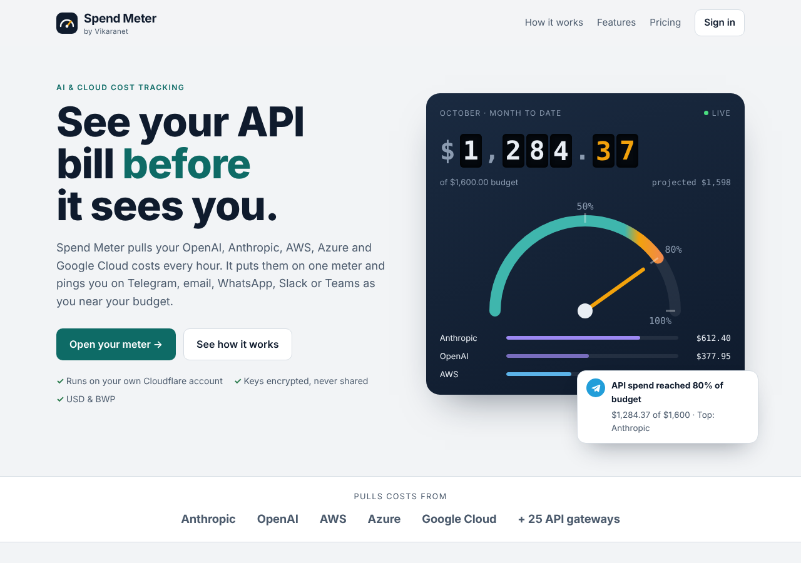
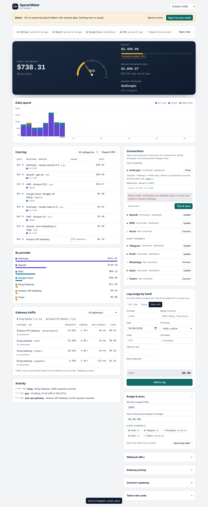

<p align="center">
  
</p>

<h1 align="center">Spend Meter</h1>

<p align="center"><b>Know your API bill before it knows you.</b><br>
Hourly cost tracking and budget alerts for OpenAI, Anthropic, AWS, Azure and Google Cloud.<br>
One small Cloudflare Worker. No code changes in your app. Free to self-host.</p>

<p align="center">
  <a href="https://deploy.workers.cloudflare.com/?url=https://github.com/victorkgwaadira-ctrl/spend-meter"></a>
</p>

<p align="center">
  <a href="https://api-spend-meter.vikaranet.workers.dev/demo">Live demo</a> ·
  <a href="docs/SETUP.md">Setup guide</a> ·
  <a href="docs/GATEWAYS.md">API gateways</a>
</p>

---

## Why

Most surprise API bills come from something small: a loop that ran all weekend, a model swapped for a pricier one, a staging key left on. Provider dashboards show it after the fact, one provider at a time.

Spend Meter reads the billing APIs your providers already have, puts every bill on one meter, and messages you at **50%, 80% and 100%** of your monthly budget, on **Telegram, email, WhatsApp, Slack or Teams**.

## Features

- **Hourly cost pulls.** Anthropic and OpenAI every hour, AWS and Azure every six, Google Cloud through budget notifications. Per model, per service, per day.
- **Budget alerts.** Each level fires once a month, with the top providers and a month-end forecast in the message.
- **Month-end forecast.** See where the month will land at today's run-rate.
- **Connections panel.** Paste a key and it's tested live, encrypted (AES-GCM) and saved. No terminal needed after deploy.
- **25 API gateways.** Kong, Apigee, AWS API Gateway, Azure APIM, Envoy, Traefik and more. Request counts, error rates and latency per API, priced per 1,000 calls.
- **Webhooks for anything.** Post costs or alerts from any script, Zapier or Make.
- **Your account, your keys.** Runs entirely in your own Cloudflare account, on the free plan for most teams.

<p align="center"></p>

## Deploy

### One click

1. Push this repo to your GitHub account, or fork it.
2. Click **Deploy to Cloudflare** above. Cloudflare creates the Worker and its database and asks for two secrets:
   - `DASHBOARD_PASSWORD`, your dashboard login
   - `WEBHOOK_TOKEN`, a long random string
3. Open `https://spend-meter.<your-subdomain>.workers.dev/app`, sign in with any username and your password, and add keys under **Connections**.

### By hand (about 10 minutes)

You need Node.js 18+ and a free Cloudflare account.

```bash
git clone https://github.com/victorkgwaadira-ctrl/spend-meter && cd spend-meter
npm install --legacy-peer-deps
npx wrangler login
npx wrangler d1 create spend-meter          # paste the database_id it prints into wrangler.toml
npx wrangler secret put DASHBOARD_PASSWORD
npx wrangler secret put WEBHOOK_TOKEN
npm run deploy
```

Tables are created automatically on first use. Then open `/app` and connect your providers. [docs/SETUP.md](docs/SETUP.md) explains where to get each key.

## Pages

| Path | What it is |
|---|---|
| `/` | Public landing page |
| `/demo` | Read-only dashboard with sample data, no sign-in |
| `/app` | Your dashboard (password protected) |
| `/hooks/...` | Webhooks for budgets, gateways and custom costs (token protected) |

## Supported sources

| Source | How | Refresh |
|---|---|---|
| Anthropic | Admin API cost report | Hourly |
| OpenAI | Admin Costs API | Hourly |
| AWS | Cost Explorer (about $0.01 per request) | Every 6 hours |
| Azure | Cost Management Query API | Every 6 hours |
| Google Cloud / Gemini | Budget notifications through Pub/Sub | Several times a day |
| AWS & Azure budgets, Twilio | Webhooks forwarded as alerts | Instant |
| 25 API gateways | Request logs posted to `/hooks/gateway/<name>` | As they arrive |
| Anything else | `POST /hooks/generic`, or by hand in the dashboard | As they arrive |

## Develop

```bash
cp .dev.vars.example .dev.vars
npm run dev                                   # http://localhost:8787
curl "http://localhost:8787/__scheduled?cron=7+*+*+*+*"   # run the hourly sync
npm run typecheck
```

The code is plain TypeScript with no framework:

```
src/index.ts        routes, auth, hourly sync
src/providers/      Anthropic, OpenAI, AWS, Azure cost pulls
src/hooks.ts        budget webhooks (Google, AWS, Azure, Twilio, generic)
src/gateways.ts     gateway log parsing and pricing
src/alerts.ts       thresholds and the five alert channels
src/connections.ts  dashboard-entered keys, encrypted at rest
src/dashboard.html  the dashboard (also served at /demo)
src/landing.html    the public landing page
schema.sql          D1 tables, applied automatically
```

Issues and pull requests are welcome. Ideas that would help most: more providers (GCP billing export, DigitalOcean, Vercel), per-team budgets, and Discord alerts.

## Security

- The dashboard uses HTTP Basic auth over HTTPS. Use a long password.
- Every webhook URL carries `WEBHOOK_TOKEN`, so treat those URLs like passwords.
- Keys entered in the dashboard are encrypted with a key derived from your dashboard password, or from `ENCRYPTION_KEY` if you set one. They're never sent back to the browser.
- Use read-only billing credentials: an IAM user limited to `ce:GetCostAndUsage`, and an Azure app with Cost Management Reader only.

Found a security issue? Please email victor.kgwaadira@vikaranet.com rather than opening a public issue.

## Licence

[AGPL-3.0](LICENSE). Free to use, modify and self-host. If you offer a modified version to others as a hosted service, you must publish your changes under the same licence.

Need it set up for your team? Managed setup is available from [Vikaranet](mailto:victor.kgwaadira@vikaranet.com?subject=Spend%20Meter%20setup).

<p align="center"><sub>Built in Gaborone, Botswana · © Vikaranet (Pty) Ltd</sub></p>
